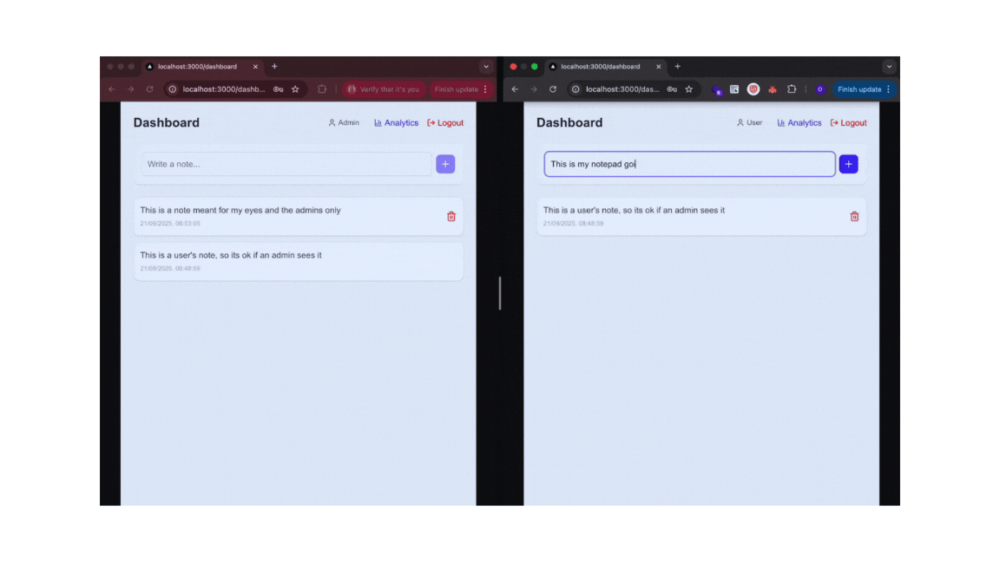

# Team Activity Tracker

A full-stack application built with Next.js and Supabase for tracking team activities and notes with real-time updates and role-based access control.



## Features

* **User Authentication**: Sign up, login, and logout functionality
* **Role-based Access Control**:

  * Regular users can only view and manage their own notes
  * Admin users can view all team members' notes
* **Real-time Updates**: Live synchronization of notes across all users (admins see all notes; users only see their own)
* **Dashboard**: Add, view, and delete notes
* **Analytics**: View weekly statistics for personal and team notes (admin only)
* **Responsive Design**: Works on desktop and mobile devices

## Tech Stack

* **Frontend**: Next.js 14, React, TypeScript, Tailwind CSS
* **Backend**: Supabase (PostgreSQL, Authentication, Real-time)
* **Deployment**: Vercel, Netlify, or any Next.js-supported platform

## Setup Instructions

### Prerequisites

* Node.js 18+ installed
* A Supabase account

### 1. Clone the Repository

```bash
git clone <your-repo-url>
cd team-activity-tracker
npm install
```

### 2. Environment Variables

Create a `.env.local` file in the root directory:

```env
NEXT_PUBLIC_SUPABASE_URL=your_supabase_project_url
NEXT_PUBLIC_SUPABASE_ANON_KEY=your_supabase_anon_key
```


### 3. Supabase Setup

1. Create a new project in Supabase
2. Go to the SQL Editor and run the following commands in order:

#### Database Schema (run first)
```sql
-- Profiles table
CREATE TABLE profiles (
  id UUID PRIMARY KEY,
  email TEXT NOT NULL UNIQUE,
  role TEXT NOT NULL DEFAULT 'user'
);

-- Notes table
CREATE TABLE notes (
  id UUID PRIMARY KEY DEFAULT gen_random_uuid(),
  user_id UUID REFERENCES profiles(id),
  content TEXT NOT NULL,
  created_at TIMESTAMPTZ DEFAULT NOW()
);

-- Archived notes table
CREATE TABLE archived_notes (
  id UUID PRIMARY KEY DEFAULT gen_random_uuid(),
  user_id UUID REFERENCES profiles(id),
  content TEXT NOT NULL,
  created_at TIMESTAMPTZ DEFAULT NOW()
);
```

#### Row Level Security Policies (run second)
```sql
-- Enable RLS
ALTER TABLE profiles ENABLE ROW LEVEL SECURITY;
ALTER TABLE notes ENABLE ROW LEVEL SECURITY;

-- Profiles policies
CREATE POLICY "Users can insert their own profile"
  ON profiles FOR INSERT
  WITH CHECK (auth.uid() = id);

CREATE POLICY "Users can select their own profile"
  ON profiles FOR SELECT
  USING (auth.uid() = id);

-- Notes policies
CREATE POLICY "Users can insert their own notes"
  ON notes FOR INSERT
  WITH CHECK (auth.uid() = user_id);

CREATE POLICY "Users can select notes"
  ON notes FOR SELECT
  USING (
    auth.uid() = user_id
    OR
    EXISTS (
      SELECT 1 FROM profiles p
      WHERE p.id = auth.uid() AND p.role = 'admin'
    )
  );

CREATE POLICY "Users can delete their own notes"
  ON notes FOR DELETE
  USING (auth.uid() = user_id);

-- Enable realtime for notes table
ALTER PUBLICATION supabase_realtime ADD TABLE notes;

-- Additional policy for admin realtime access
CREATE POLICY "Admins can see all notes in realtime"
  ON notes FOR SELECT
  USING (
    EXISTS (
      SELECT 1 FROM profiles p
      WHERE p.id = auth.uid() AND p.role = 'admin'
    )
  );
```

### 4. Run the Application

```bash
npm run dev
```

Visit `http://localhost:3000` in your browser.

## Design Decisions

### Architecture

* **Next.js App Router**: Modern React development with API routes capability
* **Supabase Integration**: Handles authentication, database, and real-time updates
* **Custom Hooks**: `useUser`, `useNotes`, and `useAnalytics` for separation of concerns
* **Type Safety**: Full TypeScript implementation

### User State Management

In a production system, I would use a global state solution (React Context, Zustand, Redux, etc.) to persist user state across pages and avoid duplicate Supabase calls.  

For this assessment, I intentionally kept it simple by fetching the user on each page load via `useUser`. This ensures correctness without adding extra complexity that would be overkill for a 2-hour exercise.


### Performance Optimizations

* **Client-side Caching**: Reduces unnecessary API calls
* **Efficient Re-renders**: Optimized component structure
* **Debounced Inputs**: Prevents excessive updates when typing notes

### Security

* **Row-Level Security**: Ensures data isolation
* **Role-based Access**: Users see only their data; admins see all

### UI/UX

* **Responsive Design**: Works on desktop and mobile
* **Loading States**: Clear feedback for async operations
* **Real-time Updates**: Live updates when users add/delete notes
* **Accessibility**: ARIA labels, keyboard navigation

## Troubleshooting

1. **Realtime not working**: Ensure replication is enabled for the notes table in Supabase
2. **Authentication issues**: Verify Supabase URL and ANON\_KEY in `.env.local`
3. **Permission errors**: Check that all RLS policies are correctly applied

## License

This project is created as part of a technical assessment.

